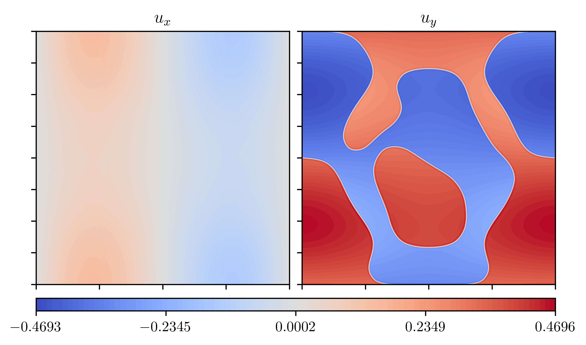
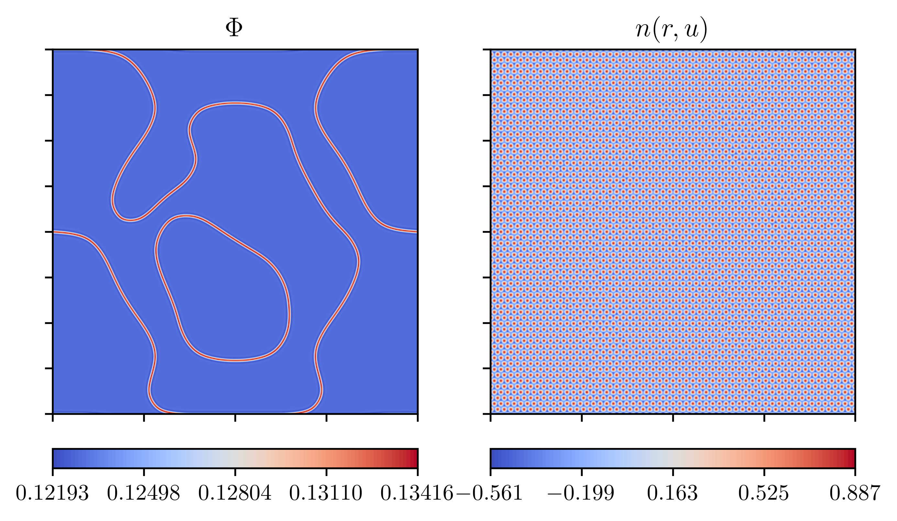
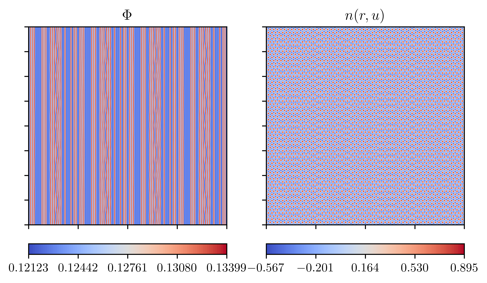

# Init solid phase

When initializing the simulation purely in the solid phase while
having periodic boundary conditions, we have to be carefull to not
introduce defects at the edges of the domain.

Since it is periodic a mismatch in the spacing can result in defects.

## Plots

General Parameters:

$$
\begin{aligned}
    \Delta B^0 &= 0.012 \\
    B^x &= 0.988 \\
    n_0 &= -0.03 = \text{const.} \\
    \beta &= 1 \\
    \mathrm{d}t &= 5 \\
    T_\text{max} &= 30000 \\
    \text{domain} &= \left[ -200, 200\right]^2 \\
    \text{number of points per axis} &= 500 \\
    a & = \frac{4}{\sqrt{3}} \pi \\
    \text{poisson ratio } \nu &= 0.5
\end{aligned}
$$

### Grow to bounds

Here the grain was initialized with a radius of $R_\text{init}=150$ and an
interface width of $10$ and then
grew to equilibrium with filling the entire domain.

### Full init

The entire domain was fully fully initialized.

