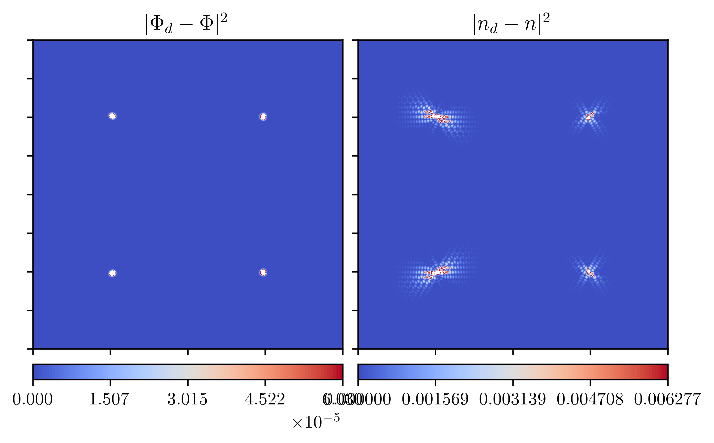
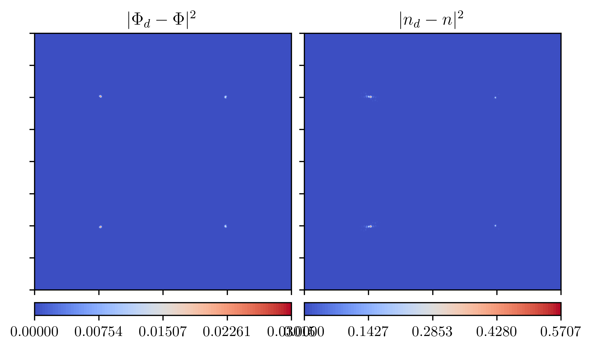
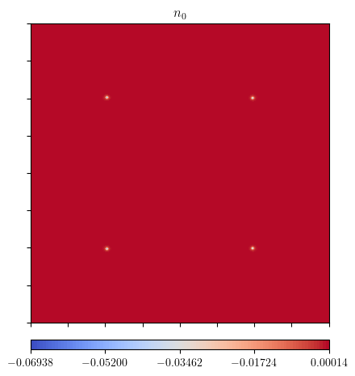

# 2023-09-27

## Summary / Notes

- did very basic comparisson between simulations with constant and varying $n_0$
- for $n_{0, \text{init}} = 0$:
  - amplitudes for varying $n_0$ generally larger
  - no difference in placement, movement and timescale of defects
- for $n_{0, \text{init}} = -0.03$:
  - dissolves from defects

## Plots

### n_0 = -0.03

stable 4 defects

amplitudes with $n_0$ varying:

### n_0 = 0

#### Stable 4 defects

difference between $n_0$ varying and const.:

The top boundary of the color-scale was made smaller to allow for more detail in
the image. All points above the new top boundary are displayed in white, which
might be a bit confusing.

Here is the same image without rescaling the boundary:

$n_0$:

#### 2 defects

spaced 80 apart

rescaled:

