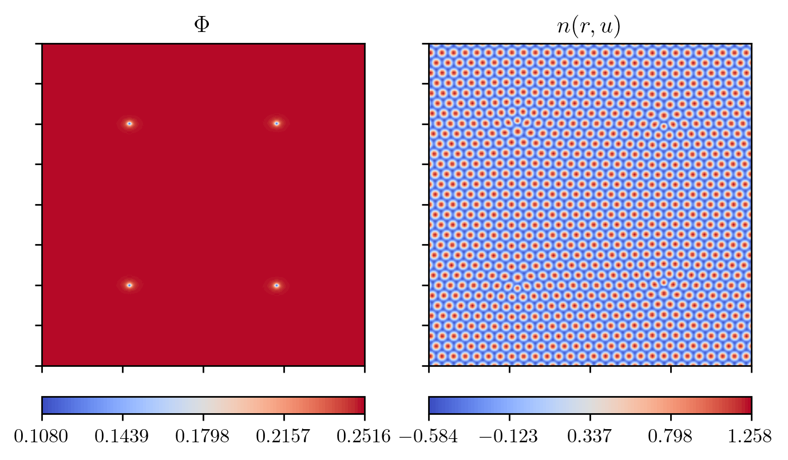
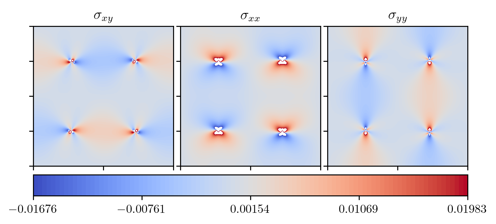
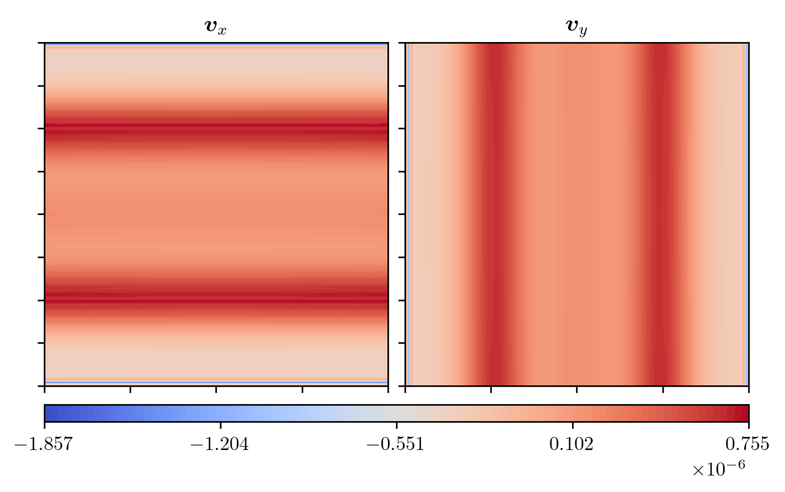
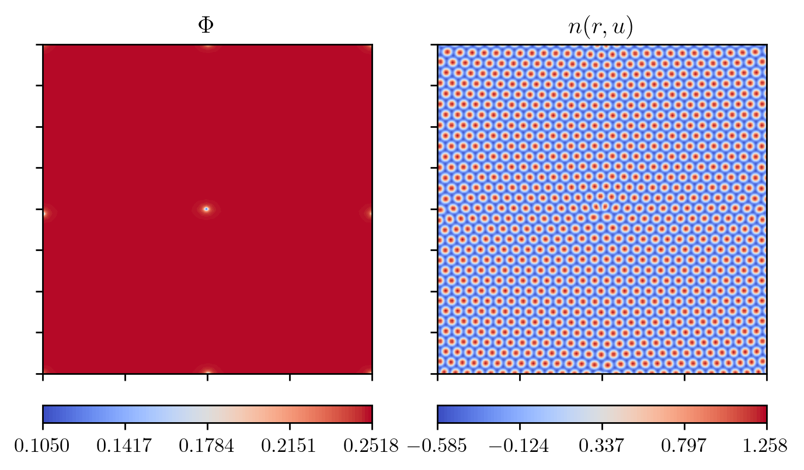
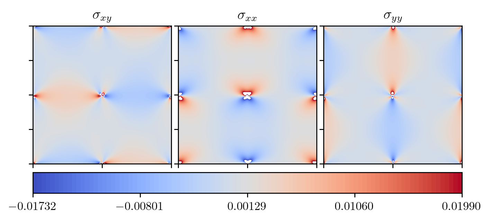
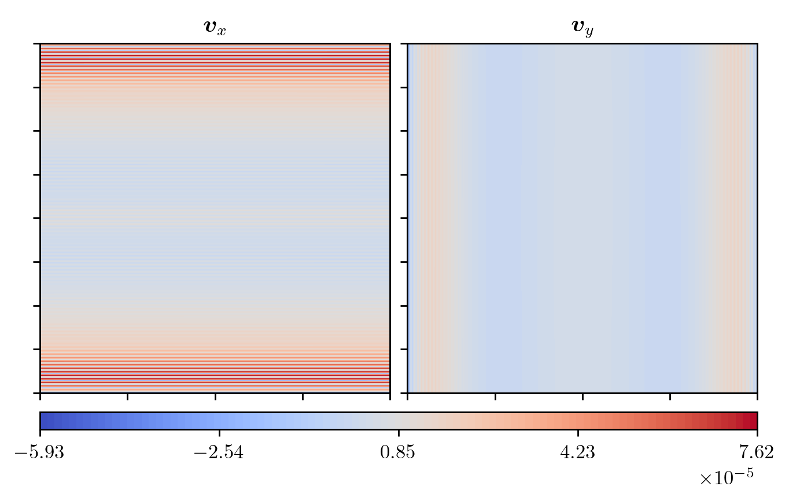
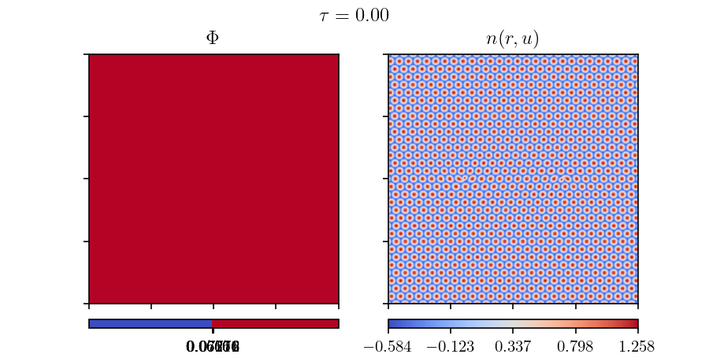
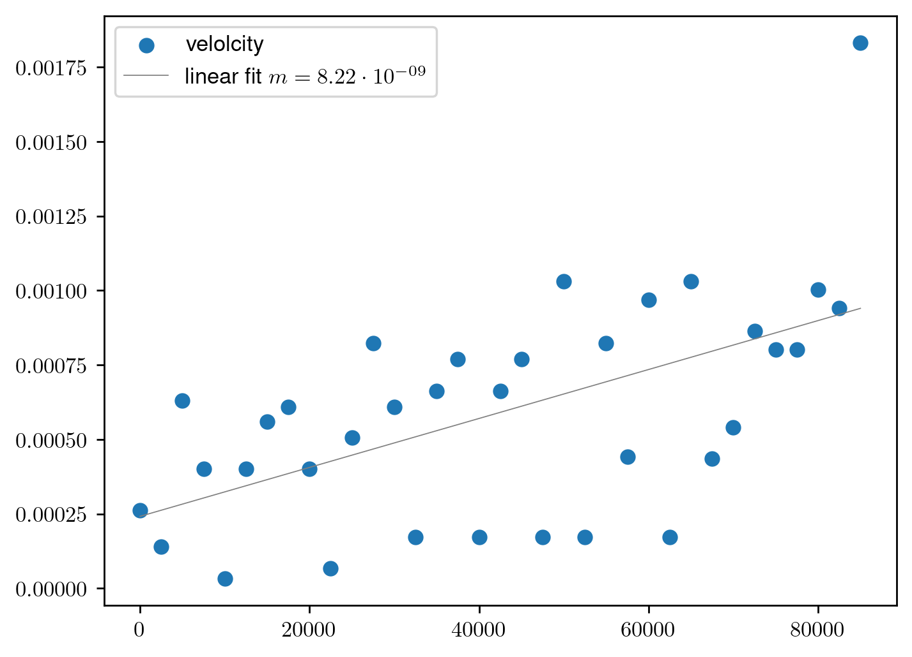

# 2023-11-01

## Hydro APFC

- implemented hapfc
  - ([used scheme](../../background/hydropfc.md))
- harder to find stable $n_0$ values
  - due to flow equation, can't set it to $0$
  - previously used value of $-0.03$ is not stable at the tested grid- and timespacing
  - values of $0.25, 0.5, 1$ were not stable for the same reasons

### Stable 4 Defect Configuration

- seems stable with 4 defect arangement
- dataset:

| $B_x$   | $\Delta B_0$ | $n_{0, \text{init}}$ | domain size                | points per axis | dt    |
|---------|--------------|----------------------|----------------------------|-----------------|-------|
| $0.988$ | $0.012$      | $0.03$               | $\left[-100, 100\right]^2$ | $200$           | $2.5$ |

- defects were placed at $(\pm 50, \pm 50)$ with burgers vectors $\boldsymbol{b} = \left[ \pm 4 / \sqrt{3} \pi, 0 \right]$
- results are shown at a time of $250\,000$ ($100\,000$ iterations)

(The min / max value on the colorscale were clamped between two values in the stress plot.
Values falling outside of that range are displayed as white.)

The velocity itself consists of many "stripes".
On 2 of the boundaries for each component there are also drop with a sign change.
Left / right for $v_y$ and top / bottom for $v_x$.

I realised this a bit to late to make changes for this update: The flow equations now
contain gradients in the non-linear parts. These are computed via finite differences.
In the code I just used the [`np.gradient`](https://numpy.org/doc/stable/reference/generated/numpy.gradient.html) function.
This fucntion uses forward / backward differences at the boundaries and central
difference in the domain. However, in all other cases periodic BC is enforced.
Could this be the reason for the stripes on the boundaries?

### Single Defect at the Center

- same dataset as above:

| $B_x$   | $\Delta B_0$ | $n_{0, \text{init}}$ | domain size                | points per axis | dt    |
|---------|--------------|----------------------|----------------------------|-----------------|-------|
| $0.988$ | $0.012$      | $0.03$               | $\left[-100, 100\right]^2$ | $200$           | $2.5$ |

- defect was placed at $(0, 0)$ with burgers vectors $\boldsymbol{b} = \left[ - 4 / \sqrt{3} \pi, 0 \right]$
- results are shown at a time of $125\,000$ ($50\,000$ iterations)

3 other defects were created to compensate for stress of the single defect
at the center. 1 x-axis, 1 y-axis and 1 in the corners.

(The min / max value on the colorscale were clamped between two values in the stress plot.
Values falling outside of that range are displayed as white.)

Velocity is, again, very "stripy".

## Defect Tracking

- I now have a way to track individual defects.
  - ({py:func}`calculations.defect_detection.get_defects_center`)
- comparisson between climbing / gliding speed of 2 defects that annialate each other
- same dataset as before:

| $B_x$   | $\Delta B_0$ | $n_{0, \text{init}}$ | domain size                | points per axis | dt    |
|---------|--------------|----------------------|----------------------------|-----------------|-------|
| $0.988$ | $0.012$      | $0.03$               | $\left[-100, 100\right]^2$ | $200$           | $2.5$ |

- all dissipation parameters $\mu$ were set to 1
- in both cases defects were initialized with the burgers vector $\boldsymbol{b} = \left[ \pm 4 / \sqrt{3} \pi, 0 \right]$
- position of defects:
  - horizontal case: $(\pm 40, 0)$
  - vertical case: $(0, \pm 40)$
- simulations were stopped after defect annihilation
- Example simulation timeline with APFC $n_0 = n_0(\boldsymbol{r})$

- extracted centroids of each defect at each recorded timestep
- calculated the velocities with forward difference on the difference of the 2 defect locations
- Example curve of velocities on the example of base $n_0 = \text{const.}$:

- I tried to somehow quantify the speed of the defects
- tried taking average speed, linear first, exponential fits and quadratic fits
  - $R^2$ values varied wildly $ \sim [0.1, 0.95]$
  - spread of values too big / distances of defects to short
  - values kinda meaningless
- average values:

| sim   | horizontal           | vertical             |
|-------|----------------------|----------------------|
| base  | $6.91 \cdot 10^{-4}$ | $5.91 \cdot 10^{-4}$ |
| n0    | $6.79 \cdot 10^{-4}$ | $4.49 \cdot 10^{-4}$ |
| hydro | $7.29 \cdot 10^{-4}$ | $8.12 \cdot 10^{-4}$ |

- linear fit $m$

| sim   | horizontal           | vertical             |
|-------|----------------------|----------------------|
| base  | $8.08 \cdot 10^{-9}$ | $8.22 \cdot 10^{-9}$ |
| n0    | $7.04 \cdot 10^{-9}$ | $3.40 \cdot 10^{-9}$ |
| hydro | $8.58 \cdot 10^{-9}$ | $1.49 \cdot 10^{-8}$ |

## TODO / Next up

- fix non-periodic BC gradients
- compare stress field with analytical values (see {cite:t}`apfc_plastic_motion`)
  - local smoothing of $\boldsymbol{u}$
- redo speed comparisson on bigger field with larger distances between defects
